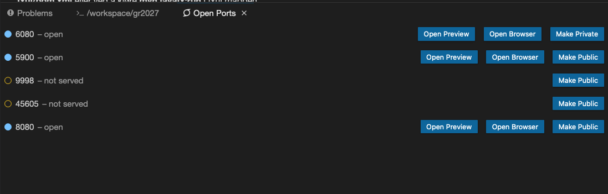

# Treningsapp

Denne appen er en trelagsapplikasjon med domenelage (logikk), brukergrensesnitt (UI) og persistens (lagring). Denne trelagsapplikasjonen er koblet til en server. En illustrasjon av strukturen kan man se på [**treningsapp/readme.md**](/treningsapp/readme.md). Videre er prosjektet konfiguert som et multi-modul-prosjekt med maven. Rot-prosjektet sin **pom.xml** her da en oversikt over submoudulene og konfigurasjonen som er felels for disse.  

## Bygging og kjøring av prosjektet
Det lagt opp til vurdering av prosjektet på Gitpod ved å trykke på merkelappen under:

### Hvordan kjøre prosjektet
Etter å ha trykket på [merkelappen](https://gitpod.idi.ntnu.no/#https://gitlab.stud.idi.ntnu.no/it1901/groups-2020/gr2027/gr2027/-/tree/master) over vil prosjektet åpne seg i gitpod. En terminal med navn workspace/2027 skal da åpne seg. I terminalen skal det stå:
gitpod workspace/gr2027/treningsapp 

Hvis det kun står gitpod workspace/gr2027 må du navigere deg inn i **treningsapp** mappen ved å utføre `cd treningsapp`. 

#### Bygg prosjektet
Inne i **treningsapp** mappen kjører du `mvn install`. Dette bygger prosjektet og gjør alle kvalitetssjekker. 

#### Start server
Før man kan bruke applikajsonen er man nødt til å starte serveren. Kjør derfor `mvn -pl integrationtests jetty:run` fra gitpod /workspace/gr2027/treningsapp. Det skal stå`Started Jetty Server` i terminalen og serveren skal ha åpnet seg i gitpod på port: `8080`.

#### Start applikasjonen
Åpne en ny terminal, og utfør `cd treningsapp`.
Fra **treningsapp** mappen utfør `mvn javafx:run -f fxui/pom.xml`.

#### Åpne applikasjon
For å åpne applikasjonen kan du gå inn i ports panelet. Og velge **open in browser** på port:`6080`. 
Her kan du også åpne serveren sin lagrede informasjon ved å åpne port: `8080` og legge til `/treningsapp` i slutten av URL'en.

#### Kjøre tester
For å kunne kjøre testen er man nødt til å kjøre `mvn install -DskipTests=false`. Testene er default satt til å ikke kjøre fordi de bruker lang tid, og i tillegg så er man nødt til at serveren kjører før man får testet fxui. Man må derfor kjøre `mvn install` deretter `mvn -pl integrationtests jetty:run` før man skriver kommandoen for å kjøre testene. Testene kan ta en god del tid, og hvis du oppelver error i terminalen se [Error håndtering](##Error håndtering!) lenger ned.

## Mappesktruktur

### Prosjektet er delt inn i fem moduler: 
* Domenelogikken og persistenslaget i [**treningsapp/core**](/treningsapp/core).
* Grensesnittet i [**treningsapp/fxui**](/treningsapp/fxui/).
* Restapi [**treningsapp/restapi**](/treningsapp/restapi).
* Restserver [**treningsapp/restserver**](/treningsapp/restserver).
* Integrationtest [**treningsapp/Integrationtest**](/treningsapp/rIntegrationtest).
 

Testene til tilhørende arkitekturlag ligger under **treningsapp/"modul"/src/test**.

## Error håndtering
Opplever du error ved `mvn install`eller `mvn test`, er dette mest sannsynlig grunnet to ting:
1. Du kjører ikke kommandoen fra gitpod workspace/gr2027/treningsapp.
    - Forsikre deg om at du er 
3. FXUI testen feilet.
    - Brukergrensesnittet er grundig testet og i skjeldne tilfeller kan det hende testen ikke klarer å laste inn elementer før den prøver å interagere med dem. 
    - Hvis dette er tilfelelt vil erroren skyldes en FXRobot

## Test, kodekvalitet og testdekningsgrad

Det er laget JUnit 5 tester av alle modulene. Disse kan man kjøre med commandoen `mvn install -DskipTests=false` i **treningsapp** mappen for å kjøre alle testene. Videre sjekkes kodekvaliteten av **CheckStyle** og **Spotbugs**.

Testdekningsgraden dekkes av **Jacoco**. Etter kommandoen `mvn verify` kan man se resultatet av testdekningsgraden i **target/classes/site/jacoco/index.html** i hver modul.
 

## Persistens (JSON, Jackson)

Appen bruker JSON og Jackson bibliotekene i persistenslaget. Vi har implementert serialisering- og deserialisering-klasser. Noe man finner i [**treningsapp/core/src/main/java/treningsapp/json**](/treningsapp/core/src/main/java/treningsapp/json)  

## Hva appen handler om, og er ment til å gjøre
Denne innformasjonen finner man under [**treningsapp/readme.md**](/treningsapp/readme.md).