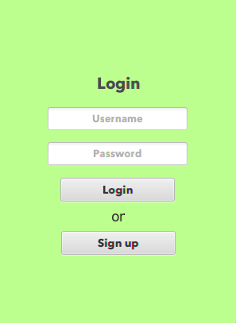
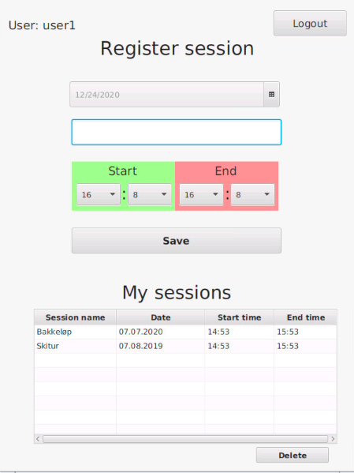
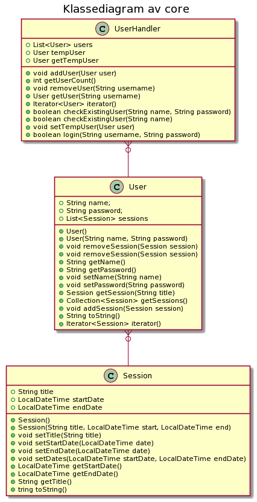
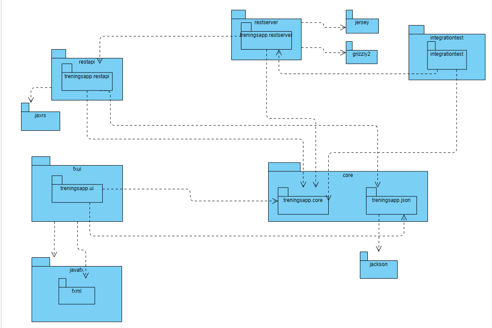
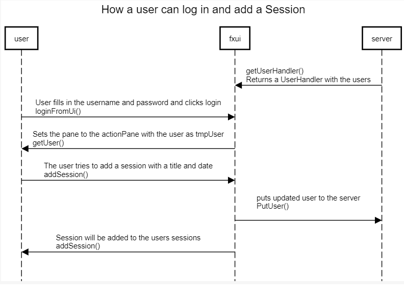

# Beskrivelse av applikasjonen 

Appen er en serverapplikasjon som lar brukere loggføre treningsøktene sine. Øktene blir presentert for brukeren i en tabellvisning med mulighet for å sortere øktene. Man kan f.eks. sorte etter alfabetisk rekkefølge, dato, og når på dagen økten ble startet/avsluttet. 
 Applikasjonen var tiltenkt vidre funksjonaliteter som en kalorikalutlator ([se brukerhistorie 3](#Brukerhistorier)), men etter oppfordringerer valgte vi heller å bruke mer tid på testing og kodekvalitet.

# Slik bruker du applikasjonen

## Logg-inn 
 

Ved å skirve inn brukernavn og passord i deres respektive felt, kan man logge seg inn med en tidligere regisrert bruker ved å trykke på **Log in** knappen. Om man heller ønsker å opprette en ny bruker 
 registrere ny bruker med **"Sign up"** knappen. 
Om man ønsker å teste en bruker som allerede har lagret data, kan man logge seg inn med: Brukernavn: `user1`  Passord:`password1`.

## Registrering av treningsøkter
 

Ved å trykke på knappen med kalenderikonet eller datofeltet får man opp en kaldender, der man kan velge en dato. Videre fyller man ut titelen på treningsøktenved å skrive inn i inputfeltet. Neste steg blir å fylle inn **starttid** og **sluttid**. Deretter ved å trykke på **save"** lagrer man økten, og legger den inn i treningsloggen din. Sortering av treningsøktene gjøres ved å trykke på **Session name**, **Date**, **Start time**, **End time**.

# Brukerhistorier  
**1.** Som en bruker av denne appen, har jeg lyst til å logge meg inn slik at jeg kan registrer den siste treningsøkten min.

**2.** Som en bruker av denne appen, har lyst å logg meg inn slik at jeg kan se mine tidligere registrerte treningsøkter.

**3.** Som en bruker av denne appen, har jeg har lyst til å registrere kaloriene mine slik at jeg kan se kaloriebalansen.  

**4.** Som enn bruker av denne appen, har jeg har lyst til å slette registrerte treningsøkter slik at jeg kan fjerne uønskede treningsøkter.

**5.** Som en bruker av denne appen, har jeg lyst til å sortere mine treningsøkter, slik at jeg kan presentere utvalget slik jeg ønsker.

# Klassediagram av core

# Pakkediagram

# Oppdeling i controllere og fxui.

Appen har tre kontrollere **TreningsAppController**, **RegisterController** og **AddSessionController**. Disse kontrollerene er kontrollere for vær sin fxml fil. For at controllerene skal kommunisere har vi valgt å bruke [Mediator Patternen](https://www.baeldung.com/java-mediator-pattern) gjennom  **ControllerMediator** som holder på instanser av kontrollerne.

# Struktur

### Tester
Vi har egne tester til lagene og en tilpasset maven modul, som arver fra en parent modul.

### Core
i core er domenelaget til appen. Core tar seg av logikk til appen. 
Core har 3 klasser. **User**, **UserHandler** og **Sessions**.
**User** tar seg av User-objektet. Brukeren har et brukernavn, et 
passord og en liste med session. **Sessions** har en tittel, en startdato 
og en sluttdato. **UserHandler** har en liste med brukere og er den klassen som tar seg av brukerhåndteringer. Core tar seg også av alle serializerene, 
som gjør om fra *json* til et objekt og omvendt.

### Fxui
Fxui er brukergrensesnittlaget til appen. Fxui står for behandligen av grensesnittet.
I fxui ligger alle kontrollerene og fxml filene til appen. Det er herifra man kjører appen. 
Dette gjør klassen **TreninsApp**.

Grensesnittet og kontrollerene blir koblet med restserveren ved hjelp av 
**TreningsAppAccess** klassen. Denne klassen sender *HTTP* requests til serveren 
og gjør at appen oppdaterer seg.

Accessklassen har en UserHandler lagret lokalt som en cache.
Dette er for å hindre at det blir sendt så mange get forespørsler til serveren.
Vi oppnår dette ved å kun hente UserHandler ved oppstart, og hvis det er data 
vi mangler. Alle metoder som oppdaterer UserHandler vil også putte endring til serveren.

### Restapi og Restserver
Restapiet er bygget opp slik at man kan hente en bruker, legge til en 
bruker, legge til en treningsøkt hos brukeren og slette en økt fra brukeren.

Restapiet består av to klassser **TreningsAppResources** og **TreningsAppService**.
**TreningsAppService** er den første klassen som får http forespørselen, her henter 
vi ut *UserHandler* hvis dette er formålet med forespørselen. Alle forespørsler som 
henviser til en spesifikk bruker blir sendt videre til **TreningsAppResources**. Denne 
klassen håndterer registrering av ny bruker, sletting og registrering av treningsøkt.

Restserveren inneholder to klasser: **ObjectMapperProvider** og **TreningsAppConfig**.
**ObjectMapperProvider** er en klassse som hjelper med serialiseringen av objekter 
ved å hente JacksonModule fra persistenslaget. Denne "hjelpeklassen" er nyttig når 
man mottar objekter i forespørsler og ved senere lagring til fil. **TreningsAppConfig** 
forteller hvilken path man skal lese og skrive til fil på. *configen* inneholder en 
*UserHandler* som lagrer all informasjonen om brukerene. Denne klassen setter opp 
UserHandler med nødvendig informasjon til jetty-serveren starter.

Lagring på serveren er per nå bare i et UserHandler objekt, dette vil si at informasjonen 
som blir sendt til serveren kun ligger i en "cache" og ved en stop av serveren vil informasjonen 
bli slettet. En senere utvikling vil være å ha en save metode i rest api 
som skriver til json fila som configen leser fra.

sekvensdiagrammet forklarer enkelt hvordan en bruker kan logge inn og legge til en 
treningsøkt, og hvordan de intragerer i grove trekk på brukeren, fxui og serveren sin side.
Brukeren blir møtt med en login skjerm der man fyller inn brukerinfo og trykker login. 
Hvis brukernavn og passord stemmer overens med en av brukerene på serveren, så vil man 
bli logget inn. Da vil grensesnittet bli satt til actionPane, og tmpUser/innlogget bruker blir satt til 
din bruker. Herifra kan man legge til en treningsøkt. som vil bli lagret i user sine økter. Brukeren
vil bli lagt på serversiden og fxui vil vise at økten har blitt lagt til.

